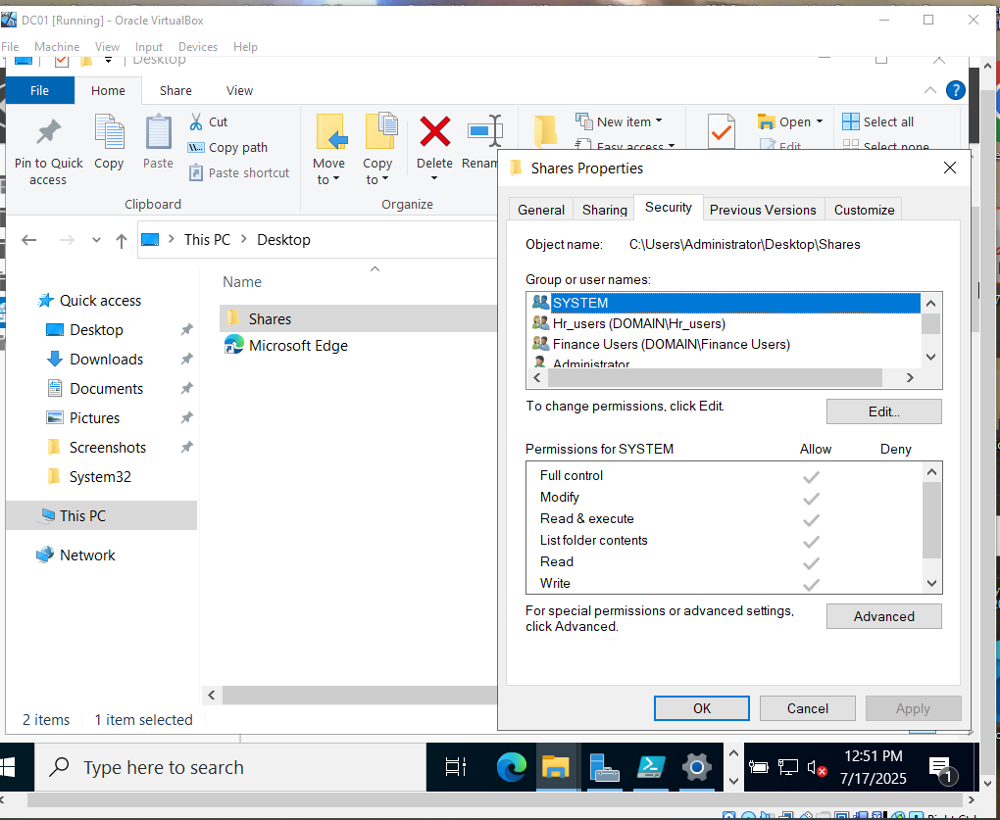

# 🛡️ Enterprise Cybersecurity Lab Setup

A hands-on, enterprise-style cybersecurity lab with Active Directory, Group Policies, file server permissions, phishing simulations, DNS sinkhole/web filtering, Sysmon logging, and red team tactics — all configured in a virtual environment.

---

## 🖥️ Table of Contents

1. [Lab Overview](#lab-overview)
2. [Requirements](#requirements)
3. [VM Setup (Domain Controller & Client)](#vm-setup)
4. [Active Directory Setup](#active-directory-setup)
5. [Users and Groups](#users-and-groups)
6. [File Server with Role-Based Access](#file-server)
7. [Group Policies (GPOs)](#group-policies)
8. [Sysmon Setup for Logging](#sysmon-logging)
9. [DNS Sinkhole & Web Filtering](#dns-sinkhole)
10. [Red Team Simulation](#red-team-simulation)
11. [How-To Guide: Key Security Implementations](#how-to-guide-key-security-implementations)
12. [Screenshots](#screenshots)
13. [Credits](#credits)

---

## ✅ Lab Overview

This lab simulates a small enterprise network for security training:

- One **Windows Server 2022** as the Domain Controller (`DC01`)
- One **Windows 11 Enterprise** as a domain-joined client (`Client01`)
- Active Directory Domain Services
- Group Policy for hardening and restrictions
- Shared folders with role-based access
- Sysmon for deep logging
- DNS sinkhole for malicious sites
- Simulated phishing site
- Red team enumeration with built-in Windows tools

---

## 🧰 Requirements

- Host OS: Windows/macOS/Linux
- Virtualization: [VirtualBox](https://www.virtualbox.org/) or VMware Workstation
- ISOs:
  - Windows Server 2022 Evaluation ISO
  - Windows 11 Enterprise ISO (64-bit x64)
- 40–60 GB disk space
- 8+ GB RAM

---

## 🏗️ VM Setup

### 📁 Create Two VMs:

| VM Name  | OS                    | Specs            |
| -------- | --------------------- | ---------------- |
| DC01     | Windows Server 2022   | 2 cores, 4GB RAM |
| Client01 | Windows 11 Enterprise | 2 cores, 4GB RAM |

### ⚙️ Networking

- Use **Internal Network** for isolated comms
- Assign static IPs (e.g., DC01: `10.0.0.1`, Client01: `10.0.0.10`)

---

## 🧱 Active Directory Setup

1. On **DC01**, open **Server Manager > Add Roles**
2. Select **Active Directory Domain Services**
3. Promote to domain controller:
   - Domain: `corp.local`
   - Set DSRM password
4. Restart after promotion

---

## 👥 Users and Groups

Use `Active Directory Users and Computers`:

### Groups

- `IT Admins`
- `Finance`
- `HR`
- `Interns`

### Users

| Username | Group     | Notes                   |
| -------- | --------- | ----------------------- |
| jsmith   | IT Admins | Domain Admin privileges |
| ajones   | HR        |                         |
| bwayne   | Finance   |                         |
| intern1  | Interns   | Least privileges        |

---

## 🗂️ File Server (Role-Based Access)

1. On DC01, create folders:

   - `C:\Shares\HR`
   - `C:\Shares\Finance`
   - `C:\Shares\Public`

2. Share folders with NTFS and share permissions:

   - `HR`: Full access to HR group only
   - `Finance`: Read/write for Finance
   - `Public`: Read for everyone

3. Test access from **Client01**

---

## 🛡️ Group Policy (GPOs)

Use `Group Policy Management` on DC01:

### Key Policies

| Policy                | Path                                   | Target Group  |
| --------------------- | -------------------------------------- | ------------- |
| Disable Control Panel | User > Admin Templates > Control Panel | Interns       |
| Hide CMD              | User > System                          | Interns       |
| Lock after 5 min idle | User > Security                        | All Users     |
| Logon warning banner  | Computer > Windows Settings > Security | All Computers |
| Block USB storage     | Computer > Removable Storage Access    | All Computers |

Apply via **OU targeting**.

---

## 🔍 Sysmon Logging

### Step 1: Download Sysmon

- [Sysinternals Suite](https://learn.microsoft.com/en-us/sysinternals/downloads/sysmon)

### Step 2: Download SwiftOnSecurity config

- [https://github.com/SwiftOnSecurity/sysmon-config](https://github.com/SwiftOnSecurity/sysmon-config)

### Step 3: Install Sysmon (Client01 & DC01)

```powershell
Sysmon64.exe -accepteula -i sysmonconfig.xml
```

### Step 4: Verify in **Event Viewer**

- Logs → Applications and Services → Microsoft → Windows → Sysmon

---

## 🌐 DNS Sinkhole & Web Filtering

### Step 1: Edit Hosts File

On **DC01**:

```plaintext
127.0.0.1 malicious.com
127.0.0.1 phishing-site.org
```

Distribute via GPO:

- Use script to overwrite `C:\Windows\System32\drivers\etc\hosts`

---

## ⚔️ Red Team Simulation

Use PowerShell on **Client01** to simulate reconnaissance:

```powershell
# Simulate user enumeration
dir "\\dc01\C$"
net user /domain
net group "domain admins" /domain
```

Also test phishing HTML with a static page hosted locally.

---

## 🛠️ How-To Guide: Key Security Implementations

### Set a Static IP Address

- Open `Network Settings` > `Change Adapter Options`
- Right-click adapter > Properties > IPv4 Settings > Set IP (e.g., `10.0.0.10`), subnet mask, and gateway

**📷 Screenshot Placeholder: Static IP Settings**

### Test the Connection to Domain Controller

```powershell
ping dc01
```

**📷 Screenshot Placeholder: Ping to DC01**

### Join the Domain

- Right-click `This PC` > Properties > `Change Settings`
- Click `Change` > Enter domain: `corp.local`
- Reboot on success

**📷 Screenshot Placeholder: Join Domain Wizard**

### Enter Domain Credentials

- When prompted, enter a valid domain user (e.g., `corp\jsmith`) and password

**📷 Screenshot Placeholder: Domain Credential Prompt**

### Log In with a Domain User

- On login screen, click `Other user`
- Enter domain credentials

**📷 Screenshot Placeholder: Logging in as Domain User**

### Group Policy Hardening

- Use `Group Policy Management`
- Create OUs for departments
- Apply hardening policies (lock screen, disable CMD, etc.)

**📷 Screenshot Placeholder: GPO Editor**

### Role-Based Access Control (RBAC)

- Create security groups (HR, Finance, etc.)
- Apply NTFS permissions to shared folders accordingly

**📷 Screenshot Placeholder: NTFS Permissions**




### Audit & Monitor Logins

- Enable audit logon events via GPO
- View logs: Event Viewer > Security

**📷 Screenshot Placeholder: Login Audit Log**

### Simulate Brute Force / Lockout

- Attempt wrong password multiple times
- Account should lock after threshold (set in GPO)

**📷 Screenshot Placeholder: Account Lockout Message**

### Deploy Sysmon for Deep Logging

- Install Sysmon with config
- Confirm logs in Event Viewer

**📷 Screenshot Placeholder: Sysmon Logs**

### Implement File Server + Role-Based Permissions

- Create `C:\Shares` folders
- Set share & NTFS permissions by group
- Test access from different domain users

**📷 Screenshot Placeholder: File Access Test**

---

## 📸 Screenshots

| Feature                 | Screenshot Placeholder |
| ----------------------- | ---------------------- |
| Static IP Configuration |                        |
| Domain Join             |                        |
| GPO Settings            |                        |
| NTFS Permission Test    |                        |
| Sysmon Logs             |                        |
| Account Lockout Event   |                        |

---

## 🙌 Credits

Created by [Enioluwa Israel Akinwande](mailto\:enioluwakinwande@gmail.com) as part of a cybersecurity portfolio lab. Built with VirtualBox, Windows Server 2022, and Windows 11 Enterprise.

---

## 💼 License

MIT License

